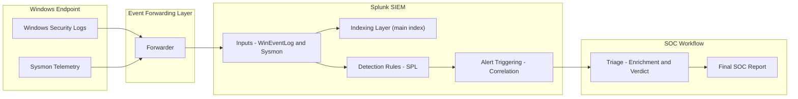

<p align="center">
  
  
  
  
</p>

<h1 align="center">Mini SOC Detection Lab</h1>

<p align="center">
A practical, hands-on SOC detection engineering project.<br>
Covers log engineering, SIEM ingestion, detection logic, alert triage, and incident reporting.
</p>

---

## 📚 Table of Contents
- Overview  
- Lab Architecture  
- Day-by-Day Progress  
- Repository Structure  
- Skills Demonstrated  
- Next Steps  
- How to Use This Repo  
- License  

---

## Overview

This project simulates an end-to-end SOC workflow:

- Windows audit policy + Sysmon baseline  
- Splunk SIEM onboarding  
- Detection engineering using SPL  
- Alert triage with evidence collection  
- Full SOC investigation report  
- A polished, recruiter-ready portfolio project  

It demonstrates real-world blue team and detection engineering capability.

---

## Lab Architecture

### 📊 Mermaid Architecture



## Day-by-Day Progress

### 🧩 Day 1 – Logging Baseline  
- Enabled Windows Audit Policy  
- Installed Sysmon with hardened config  
- Verified 4624/4625 + Sysmon logs  
Docs: day01-log-setup.md  
Evidence: evidence/day01/

---

### 📡 Day 2 – Splunk SIEM Setup  
- Installed Splunk  
- Ingested WinEventLog + Sysmon  
- Verified indexing + sourcetypes  
Docs: day02-siem-setup.md  
Evidence: evidence/day02/

---

### 📥 Day 3 – Dataset Export  
- Queried 7 days of authentication events  
- Exported Sysmon Event ID 1  
- Stored CSV datasets  
Docs: day03-ingest.md  
Evidence: evidence/day03/

---

### 🛡️ Day 4 – Detection Engineering  
- Excessive failed logons SPL  
- Success-after-failure detection  
- LOLBins behavior analysis  
Docs: day04-detections.md  
Evidence: evidence/day04/

---

### 🚨 Day 5 – Alert Triage  
- Triggered authentication anomaly  
- Performed enrichment  
- Correlated 4625 + Sysmon  
- Determined false positive  
- ATT&CK: T1110  
Docs: day05-triage.md  
Evidence: evidence/day05/

---

### 📝 Day 6 – SOC Investigation Report  
- Executive summary  
- Findings  
- Recommendations  
- Evidence documentation  
Docs: day06-report.md  
Evidence: evidence/day06/

---

### 🧹 Day 7 – README Polish  
- Final README  
- Mermaid + PNG diagrams  
- Repo cleanup  
Evidence: evidence/day07/

---

## Repository Structure  

```text
.
├── README.md                          # Full lab overview and instructions
├── LICENSE                            # MIT license
│
├── day01-log-setup.md                 # Day 1 – Audit Policy + Sysmon
├── day02-siem-setup.md                # Day 2 – Splunk onboarding
├── day03-ingest.md                    # Day 3 – Dataset exports
├── day04-detections.md                # Day 4 – Detection engineering
├── day05-triage.md                    # Day 5 – Alert triage
├── day06-report.md                    # Day 6 – SOC investigation report
│
└── evidence/
    ├── day01/                         # Baseline configuration evidence
    ├── day02/                         # SIEM screenshots + inputs
    ├── day03/                         # CSV dataset exports
    ├── day04/                         # Detection evidence
    ├── day05/                         # Triage screenshots + raw events
    ├── day06/                         # Report visuals (optional)
    └── day07/                         # Architecture PNG 
```
---

## Skills Demonstrated

### Log Engineering
- Windows Audit Policy tuning  
- Sysmon configuration  
- Event ID mapping  

### Splunk SIEM
- Data ingestion pipelines  
- Sourcetype validation  
- SPL correlation + detections  

### Detection Engineering
- Authentication anomaly logic  
- Success-after-failure correlation  
- LOLBins detection logic  

### SOC Analyst Skills
- Triage workflow  
- Event enrichment  
- ATT&CK mapping  
- False positive analysis  

### Reporting
- Executive summary creation  
- Findings + recommendations  
- Evidence-based conclusions  

---

## Next Steps

- Add lateral movement detections  
- Add persistence detections  
- Expand Sysmon telemetry  
- Build Splunk dashboards  
- Add Purple Team simulation  

---

## How to Use This Repo

Use this project as:

- A SOC portfolio showcase  
- A Splunk detection engineering lab  
- A triage workflow reference  
- A template for blue team documentation  

---

## License

MIT License — see [LICENSE](LICENSE).

