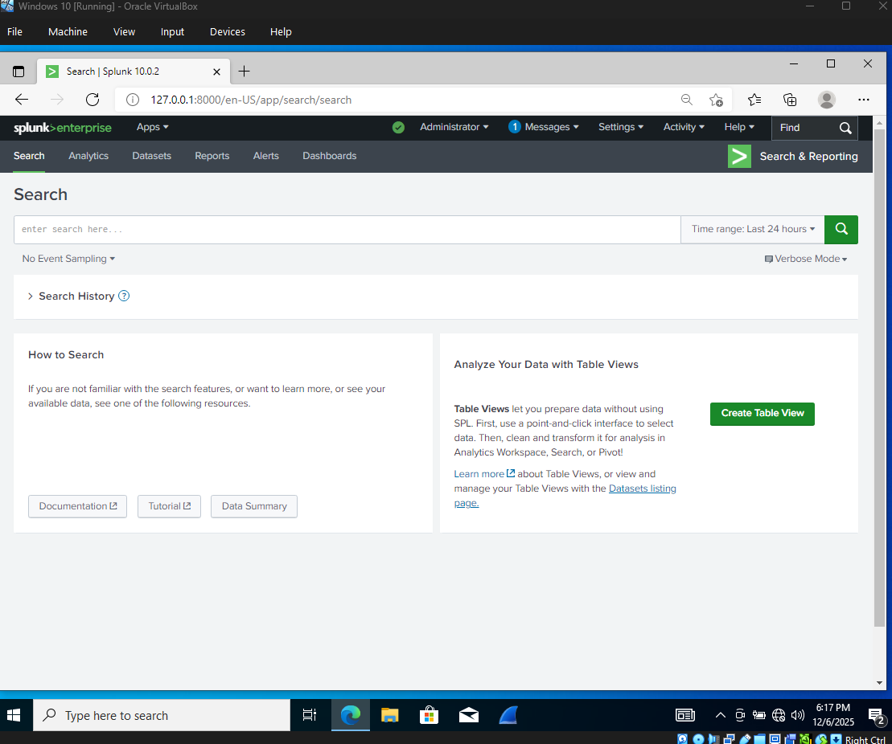

*Figure 1: Overview of the Splunk SIEM environment used during log analysis and alert triage.*

# 🛡️ Day 6 – SOC Investigation Report  
**Tag:** @SOC-DAY6-REPORT  
**Date:** 12/07/2025  

---

# 1. Executive Summary

During Days 1–5 of the Mini SOC Detection Lab, several foundational detections were deployed across Windows Security Logs and Sysmon Event telemetry. On Day 5, one of these detections — excessive failed logons — generated an alert tied to the user **Tim** on workstation **DESKTOP-0VN9UV0**.

A full triage investigation was performed following SOC Tier 1 and Tier 2 processes. Based on the analysis, the authentication pattern was determined to be **benign**, most likely caused by normal user password mistyping. No lateral movement, suspicious Sysmon activity, or correlated successful logons indicated malicious intent.

Although this alert was non-threatening, the investigation successfully validated the detection pipeline, triage workflow, enrichment techniques, and evidence collection process. The environment is now fully prepared for handling more advanced detections and intrusion scenarios.

**Final Assessment:**  
- **Risk Level:** Low  
- **Impact:** None  
- **Recommended Action:** Close alert; continue monitoring with enhanced telemetry coverage.

---

# 2. Analyst Findings

### 2.1 Summary of Activity
- The brute-force detection rule flagged **2 failed logons** within a 5-minute window.
- The attempts occurred on a single host: **DESKTOP-0VN9UV0**.
- The affected account was a valid local user: **Tim**.
- No follow-up successful logon (Event ID 4624) occurred within the same time frame.

### 2.2 Enrichment Results
- **4625 Raw Event Review:**  
  Event data shows a standard failed login with no unusual metadata.
- **4624 (Successful Logon) Search:**  
  No correlated success indicating compromise.
- **Sysmon Correlation (5-minute window):**  
  No process creation anomalies, LOLBins, or suspicious command lines.

### 2.3 Behavioral Assessment
- Failed logon volume was **below true brute-force thresholds**.
- Spread was limited to **one host**, not distributed.
- Behavior is consistent with **accidental mistyping** rather than automated attacks.

### 2.4 Root Cause Evaluation
- **Root Cause:** Benign user authentication error  
- **Threat Classification:** False Positive  
- **MITRE ATT&CK Mapping:**  
  - **T1110 — Brute Force**  
    - *T1110.001 Password Guessing*  
    - *T1110.003 Password Spraying*  
  (Aligned with detection intent, not with final outcome)

---

# 3. Recommendations

### 3.1 Detection Improvements
- Implement thresholds that better distinguish human error vs. brute-force tools.
- Add IP-based aggregation once network logs are included.
- Develop a “success-after-failures” correlation dashboard for faster triage.

### 3.2 Logging Enhancements
- Expand Sysmon configuration to include:
  - Network connections (Event ID 3)
  - Image loads (Event ID 7)
  - WMI activity (Event ID 19, 20)
- Enable Windows Defender ASR logs for credential-harvesting behavior.

### 3.3 User and Host Hardening
- Encourage strong password hygiene.
- Enable account lockout policies to reduce brute-force risk.
- Consider enabling MFA if applicable.

### 3.4 SOC Workflow Maturity
- Add automated enrichment lookups to reduce manual triage time.
- Implement a standardized triage checklist template for future alerts.

---

# 4. Evidence Compilation

| Day | File / Folder | Description |
|-----|----------------|-------------|
| Day 1 | `day01-log-setup.md` | Windows audit policy + Sysmon configuration evidence |
| Day 2 | `day02-siem-setup.md` | SIEM configuration and ingestion validation |
| Day 3 | `day03-ingest.md` | Dataset exports from Splunk (Security + Sysmon logs) |
| Day 4 | `evidence/day04/` | Detection results and SPL logic |
| Day 5 | `evidence/day05/` | Alert bucket screenshot, raw 4625 event, enrichment results |
| Day 5 | `day05-triage.md` | Full triage workflow and ticket summary |

---

# 5. Appendix

### SPL Queries Used in This Investigation

**Security Log Failed Logons (4625):**
```spl
index=main sourcetype="WinEventLog:Security" EventCode=4625
| eval User = coalesce(AccountName, Account_Name, TargetUserName, SubjectUserName)
| bin _time span=5m
| stats count by _time, User, host
| sort -_time
